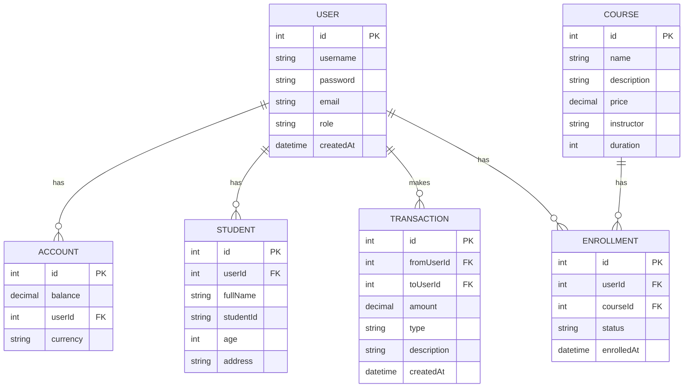

# Student Management System

A comprehensive student management system with course enrollment, payment processing, and money transfer capabilities. Built with NestJS, Next.js, and PostgreSQL.

## 🚀 Features

### Authentication & Authorization
- JWT-based authentication
- Role-based access control (Admin, Student)
- Secure password hashing with bcrypt

### Admin Features
- Create and manage student accounts
- Set/update student account balances
- View all transactions
- Manage courses
- Fix admin role permissions

### Student Features
- View account balance
- Transfer money to other students
- Purchase courses
- View transaction history
- View enrolled courses

### Course Management
- CRUD operations for courses
- Course enrollment with payment processing
- Course search and filtering

## 🏗️ System Architecture

### Backend (NestJS)
- **RESTful API** - Built with NestJS framework
- **Database** - PostgreSQL with TypeORM
- **Authentication** - JWT with Passport.js
- **Validation** - Class-validator for request validation
- **Documentation** - Swagger/OpenAPI

### Frontend (Next.js)
- **UI Framework** - React with TypeScript
- **State Management** - React Context API
- **Styling** - CSS Modules
- **Form Handling** - React Hook Form

### Database Schema


## 🛠️ Setup & Installation

### Prerequisites
- Docker and Docker Compose
- Node.js (v16+)
- npm or yarn

### Running with Docker (Recommended)
1. Clone the repository:
   ```bash
   git clone <repository-url>
   cd tester_api
   ```

2. Start the application:
   ```bash
   docker-compose up -d
   ```

3. Access the application:
   - Frontend: http://localhost:3000
   - Backend API: http://localhost:3001
   - Swagger UI: http://localhost:3001/api

### Local Development
1. Install dependencies:
   ```bash
   # Install backend dependencies
   cd backend
   npm install
   
   # Install frontend dependencies
   cd ../frontend
   npm install
   ```

2. Set up environment variables:
   - Copy `.env.example` to `.env` in both `backend` and `frontend` directories
   - Update the values as needed

3. Start the development servers:
   ```bash
   # In backend directory
   npm run start:dev
   
   # In frontend directory (new terminal)
   cd ../frontend
   npm run dev
   ```

## 🔐 Authentication

### Default Admin Account
- **Username**: admin
- **Password**: admin123

### JWT Authentication
1. Login to get an access token:
   ```bash
   curl -X POST http://localhost:3001/auth/login \
     -H "Content-Type: application/json" \
     -d '{"username":"admin","password":"admin123"}'
   ```

2. Use the token in subsequent requests:
   ```
   Authorization: Bearer <your-jwt-token>
   ```

## 📚 API Documentation

### Admin Endpoints

#### Create Student
```http
POST /admin/students
```
**Request Body:**
```json
{
  "username": "student1",
  "email": "student1@example.com",
  "fullName": "John Doe",
  "password": "student123"
}
```

#### Set Student Balance
```http
PUT /admin/students/:id/balance
```
**Request Body:**
```json
{
  "balance": 1000.00,
  "description": "Initial balance"
}
```

### Student Endpoints

#### Get Account Balance
```http
GET /me/account
```

#### Transfer Money
```http
POST /transactions/transfer
```
**Request Body:**
```json
{
  "toUserId": 2,
  "amount": 100.00,
  "description": "Lunch money"
}
```

#### Buy Course
```http
POST /courses/:id/buy
```

### Course Endpoints

#### List All Courses
```http
GET /courses
```

#### Get Course Details
```http
GET /courses/:id
```

## 🧪 Testing

### Backend Tests
```bash
# Run unit tests
cd backend
npm test

# Run e2e tests
npm run test:e2e
```

## 🚀 Deployment

### Production Build
```bash
# Build the application
docker-compose -f docker-compose.prod.yml build

# Start the application
docker-compose -f docker-compose.prod.yml up -d
```

## 🤝 Contributing
1. Fork the repository
2. Create your feature branch (`git checkout -b feature/AmazingFeature`)
3. Commit your changes (`git commit -m 'Add some AmazingFeature'`)
4. Push to the branch (`git push origin feature/AmazingFeature`)
5. Open a Pull Request

## 📄 License
This project is licensed under the MIT License - see the [LICENSE](LICENSE) file for details.
